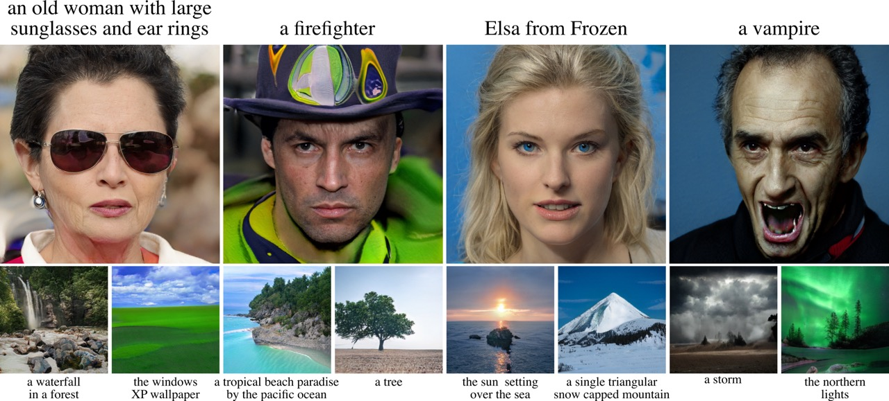

# clip2latent: Text driven sampling of a pre-trained StyleGAN using denoising diffusion and CLIP

[](TODO)
[](TODO)
[](TODO)
[](TODO)


> ## Abstract
>
> We introduce a new method to efficiently create text-to-image models from a pre-trained CLIP and StyleGAN. It enables text driven sampling with an existing generative model without any external data or fine-tuning. This is achieved by training a diffusion model conditioned on CLIP embeddings to sample latent vectors of a pre-trained StyleGAN, which we call \textit{clip2latent}. We leverage the alignment between CLIP’s image and text embeddings to avoid the need for any text labelled data for training the conditional diffusion model. We demonstrate that clip2latent allows us to generate high-resolution (1024x1024 pixels) images based on text prompts with fast sampling, high image quality, and low training compute and data requirements. We also show that the use of the well studied StyleGAN architecture, without further fine-tuning, allows us to directly apply existing methods to control and modify the generated images adding a further layer of control to our text-to-image pipeline.



## Installation

```
git clone https://github.com/justinpinkney/clip2latent.git
cd clip2latent
python -m venv .venv --prompt clip2latent
. .venv/bin/activate
pip install --upgrade pip
pip install -r requirements.txt
```

CITATION

ETC